# Little Buck Loader, LLC: Our Whole Product Line

## Contents

- [Who we are](#who-we-are)
- [How this page is organized](#how-this-page-is-organized)
- [Front-end loaders](#front-end-loaders)
    - [Little Buck Loader](#little-buck-loader)
    - [Little Bull Loader](#little-bull-loader)
    - [Little Bull QuikMount](#little-bull-quikmount)
    - [Z Buck](#z-buck)
- [The QuikSystem](#the-quiksystem)
    - [Little Bull QuikSystem (the bundle)](#little-bull-quiksystem-the-bundle)
    - [QuikConvert Kit](#quikconvert-kit)
    - [QuikBucket](#quikbucket)
    - [QuikForks](#quikforks)
    - [QuikGrapple](#quikgrapple)
    - [QuikSnow, the 50-inch pusher](#quiksnow-the-50-inch-pusher)
- [Grapples](#grapples)
    - [Antler Grappler](#antler-grappler)
    - [JD Talon](#jd-talon)
    - [KBX Talon](#kbx-talon)
- [Buckets, forks and blades](#buckets-forks-and-blades)
    - [Replacement Bucket](#replacement-bucket)
    - [Bucket Extender / Snow Pusher](#bucket-extender--snow-pusher)
    - [Pallet Fork Kit](#pallet-fork-kit)
    - [70-inch Skid Steer Boom Pole](#70-inch-skid-steer-boom-pole)
- [Ballast](#ballast)
    - [DIY Weight Basket](#diy-weight-basket)
    - [Weight Bar](#weight-bar)
- [Handling gear and small hardware](#handling-gear-and-small-hardware)
    - [Roll-Off Caster Kit](#roll-off-caster-kit)
    - [Tough Man Top Plate](#tough-man-top-plate)
    - [Center Hook](#center-hook)
    - [D-Ring](#d-ring)
    - [Ball Hitch and Receiver](#ball-hitch-and-receiver)
- [Kits for people who like to build](#kits-for-people-who-like-to-build)
    - [Little Buck Build Kit](#little-buck-build-kit)
    - [Loader Conversion Kit](#loader-conversion-kit)
- [Merchandise](#merchandise)
- [Full price list](#full-price-list)
- [Things we recommend but do not make](#things-we-recommend-but-do-not-make)
- [What we do not make](#what-we-do-not-make)
- [Buying, shipping and contact](#buying-shipping-and-contact)
- [About this page](#about-this-page)

---

## Who we are

We are a family shop in Sycamore, Illinois, and we have been welding
aftermarket front-end loaders since 2015. Our focus is narrow on
purpose. We build loaders for the machines the big manufacturers
ignore: garden tractors, zero-turn mowers, sub-compacts. If you own an
X758 or a BX23S, nobody at the dealership has a good answer for you.
We do.

Our catalog is bigger than most people realize. Everyone knows the two
loaders. Fewer know we also make a boom pole, a mechanical grapple that
needs no third hydraulic circuit, two kinds of ballast, and a build kit
for anyone with a welder and a free weekend.

Prices below were current on **8 September 2026**. They change, and our
shop page is always the authority.

---

## How this page is organized

Our shop menu splits things three ways: Front-End Loaders and More,
Grapples, and QuikSystem. That works well for browsing, but it buries
some of the smaller hardware. So this page walks the whole catalog
instead, grouped by what each thing actually does.

One thing worth understanding before you read further. We sell into two
different worlds, and some products only make sense in one of them:

- **Garden tractor world.** The Little Buck and Little Bull mount to
  John Deere lawn and garden tractors. Their attachments bolt on or
  pin on, and they use the tractor's own hydraulics.
- **Skid steer quick attach (SSQA) world.** Compact tractors and skid
  steers already have a standard mounting plate. Several of our
  products speak that language instead, which is why we keep separate
  Kubota and Bobcat compatibility pages.

The QuikSystem is the bridge. It puts an SSQA-style plate on the end
of a Little Bull's arms.

---

## Front-end loaders

### Little Buck Loader

The one we are named for, and the place most people start. It drops
onto the tractor's front weight bracket and is held by two
spring-loaded pins, which is why it goes on and off so easily.

| | |
|---|---|
| **Price** | $2,490 |
| **Lift capacity** | 340 lbs |
| **Breakout force** | 450 lbs |
| **Max lift height** | 5 ft 9 in |
| **Bucket** | 48 in wide, 4 cu ft |
| **Weight** | around 250 lbs |
| **Works with a cab** | yes, hard or soft |

It fits a long list of John Deere garden tractors: the 300 series (300,
314, 316, 317, 318, 322, 330, 332), the 400 series (400, 420, 425,
430, 445, 455) and the X series. Check our compatibility page for your
exact model, because the list has gaps.

### Little Bull Loader

Our heavy-lift model. Instead of hanging off the weight bracket it
bolts to the tractor frame through mid-mount brackets, with support
arms and turnbuckles carrying the load back. More capacity, more
install work, and no room left for a cab.

| | |
|---|---|
| **Price** | $3,490 |
| **Lift capacity** | 440 lbs |
| **Breakout force** | 550 lbs |
| **Max lift height** | 5 ft 9 in |
| **Bucket** | 48 in wide, 4 cu ft |
| **Weight** | 350 to 450 lbs |
| **Mounting jack** | included, detachable, on rollers |
| **Works with a cab** | no |

Aimed at the X700 signature series and similar heavier frames.

### Little Bull QuikMount

A Little Bull with redesigned arms ending in a quick-attach plate. Buy
it this way if you already know you want more than a bucket. **$4,490.**

Everything in the QuikSystem section below hangs off this plate.

| Front view | Side view |
|---|---|
|  |  |

### Z Buck

A loader for zero-turn mowers and UTVs. Zero-turns have no hydraulics
to borrow, so the Z Buck runs on its own electric system. Listed at
**$3,390** and currently marked unavailable on our shop page, so give
us a call before you plan around it.

| The Z Buck | Demo video (click) |
|---|---|
|  |  |

---

## The QuikSystem

This is the newest part of our catalog. The problem it solves is boring
but real: swapping a bucket for forks on a pinned loader means crawling
around with a punch and a hammer, and most people only do it twice
before they stop bothering.

The QuikMount plate ends that. Attachments lock on without tools, and
the fitment repeats, so the thing you take off in October goes back on
the same way in March.

### Little Bull QuikSystem (the bundle)

Everything at once: QuikMount loader, bucket, forks, grapple and snow
pusher. **$6,990.** Buying the pieces separately comes to more, so the
bundle is the better deal if you want the full set.

### QuikConvert Kit

Already own a standard Little Bull? This adds the quick-attach
capability without replacing the loader. **$1,390.**

### QuikBucket

Our 48-inch utility bucket, available with either an SSQA or a
QuikSystem mount. **$850.** Forty-eight inches is a deliberate choice.
It is narrow enough to see past, which matters more than volume when
you are grading or backing into a mulch pile.

### QuikForks

Pallet forks for the quick-attach plate. **$590.**

### QuikGrapple

Brush and debris grapple, mechanical, driven by the loader's existing
functions. No third hydraulic circuit needed. **$1,590.**

### QuikSnow, the 50-inch pusher

Sold as the **50" Snow Pusher**, **$800**, with a choice of SSQA or
QuikSystem mounting. A pusher is a box, not a blade. It carries snow
forward instead of casting it sideways, which is what you want on a
driveway with edges you care about. Fifty inches also fits places an
eight-foot commercial pusher cannot turn around in.

---

## Grapples

We have quietly built a second business here, and it is the engineering
we are proudest of. A normal grapple needs a third hydraulic circuit,
which on a small tractor means a valve, hoses, a diverter, and a bill.
Ours are mechanical. We use linkage so the loader's existing curl
function does the gripping.

Three models, sorted by what tractor you own.

### Antler Grappler

For Little Buck and Little Bull loaders. A three-foot-wide jaw for
brush, logs, limbs and general yard debris. **$890.**

| The Antler Grappler | Demo video (click) |
|---|---|
| 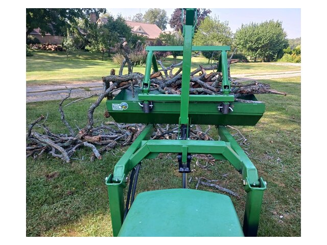 |  |

### JD Talon

For John Deere compact tractors running the factory 120R loader, which
covers the 1025R and 1023E. **$1,590.** Note that this one is not for
the Little Buck or Little Bull at all. It is a standalone product that
fits Deere's own loader.

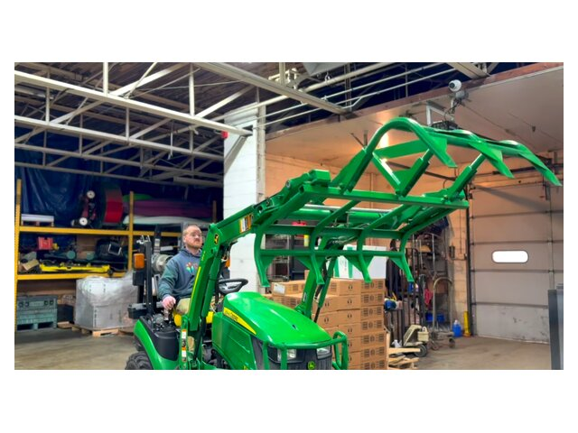

### KBX Talon

The Kubota version, for BX series tractors from 2013 onward with SSQA
quick attach. **$1,590.** The mechanical linkage is patent pending.

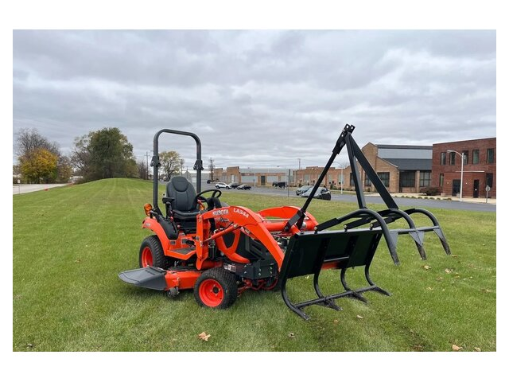

---

## Buckets, forks and blades

### Replacement Bucket

A fresh 48-inch bucket for a loader whose original one has been worn
thin or bent. **$590.**

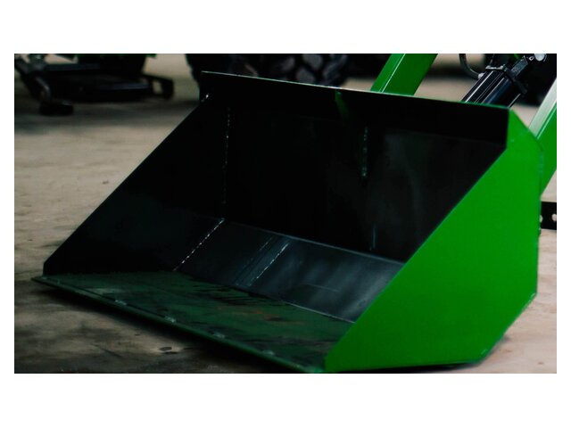

### Bucket Extender / Snow Pusher

A bolt-on extension for the Little Buck bucket. It raises capacity for
light bulky material and doubles as a snow pusher in winter. **$550.**

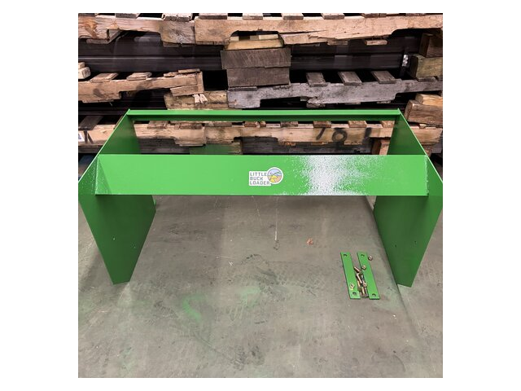

### Pallet Fork Kit

Heavy-duty forks for moving pallets, lumber and stacked material.
**$490.**

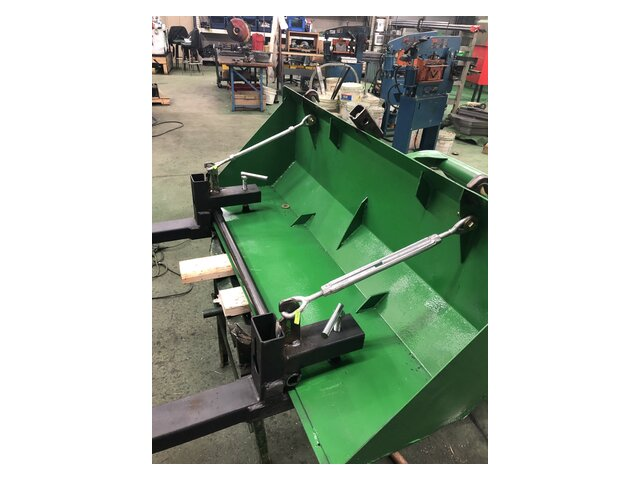

### 70-inch Skid Steer Boom Pole

The odd one out in our catalog, and a reminder that we are a welding
shop first. A straight boom for full-size wheel and track loaders,
rated to 1,100 lbs, on a standard quick attach. **$490.** Nothing to do
with garden tractors. If you have a skid steer and need to lift
something long and awkward, here it is.

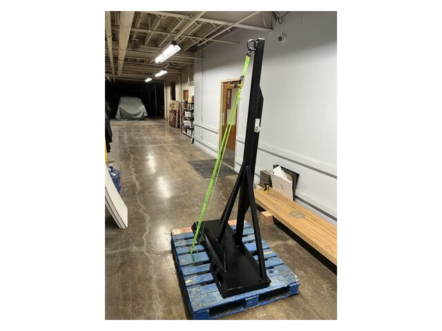

---

## Ballast

Every loader manual says the same thing and every owner ignores it
once. Weight on the front lifts weight off the rear, and a tractor
with light rear wheels does not steer and does not stop. We sell two
answers.

### DIY Weight Basket

A 16 x 9 x 16 inch basket that holds six patio pavers. **$190.** Total
comes to roughly 255 lbs with the pavers in it, and the pavers cost
almost nothing at any hardware store.

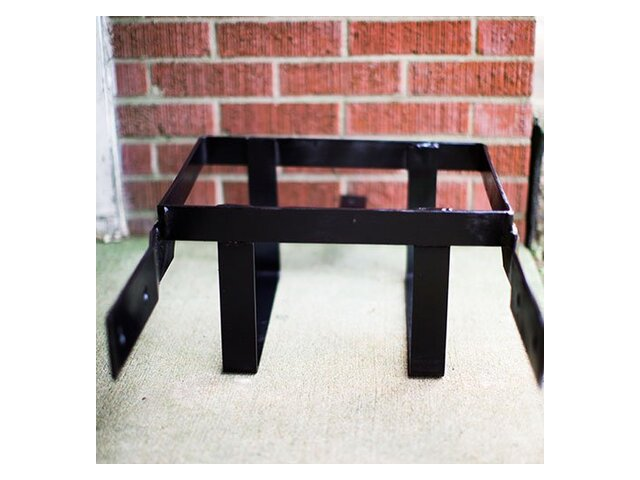

### Weight Bar

An 18 x 3 x 12 inch bar that carries six 42-lb suitcase weights, about
262 lbs loaded. **$120.** The better choice if you already own suitcase
weights.

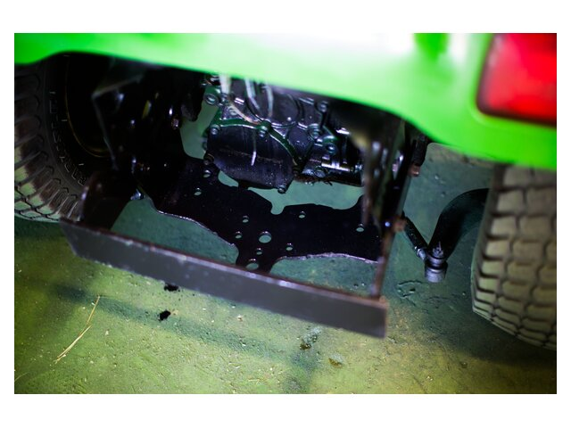

---

## Handling gear and small hardware

### Roll-Off Caster Kit

Casters that let a detached loader roll instead of sit. **$490.** Take
the loader off, roll it into a corner, and get your garage floor back.
Anyone who has tried to shove 250 lbs of steel across concrete
understands the appeal.

| The caster kit | Install video (click) |
|---|---|
|  |  |

### Tough Man Top Plate

Welds to the top of the bucket and gives you a rated lift point, good
for 350 lbs. Available with a ring or a D-ring. **$190.**

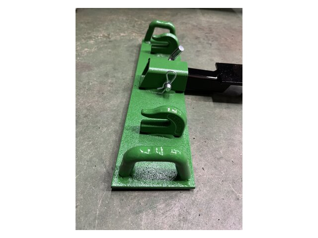

### Center Hook

A 5/16 inch heavy-duty hook for chains. **$24.**

### D-Ring

A weld-on anchor point for chains and straps. **$35.**

### Ball Hitch and Receiver

A 2 inch ball in a 1.25 inch receiver, for nudging trailers around
with the loader instead of backing the tractor up to them. **$90**, and
currently sold out.

---

## Kits for people who like to build

### Little Buck Build Kit

The components of a Little Buck, minus the assembly. **$630.** You
supply the welder, the time and the nerve. It is a real discount
against $2,490, and it exists because a fair number of our customers
are the kind of people who would rather build it themselves.

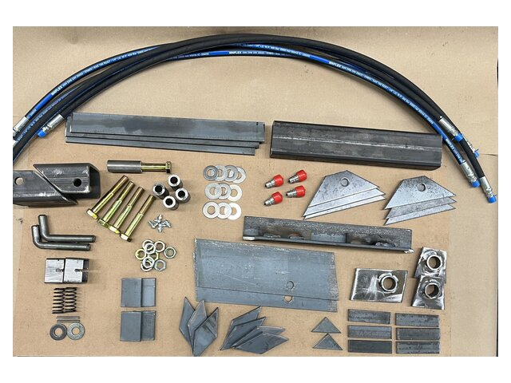

### Loader Conversion Kit

A mounting base and hydraulic hoses for moving an existing loader from
one tractor to another. **$790.** Sell the 425, keep the loader, buy
the kit for the X734. Cheaper than starting over. Call us before you
order, because the fit depends on the exact year.

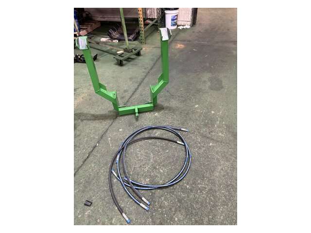

---

## Merchandise

- **T-Shirt**, $25, cotton, several colors.
- **Hoodie**, $50, gray, men's and women's sizes.

You may also see a **Miscellaneous Parts Charge** line at $710 in the
shop. That is not a product. It is a placeholder we use to bill for
custom or replacement parts once we have worked them out with you over
the phone.

---

## Full price list

Everything in one table, current 8 September 2026.

| Product | Price | What it is |
|---|---|---|
| Little Bull QuikSystem | $6,990 | Bundle: QuikMount loader plus four attachments |
| Little Bull QuikMount | $4,490 | Little Bull with quick-attach plate |
| Little Bull Loader | $3,490 | Heavy-lift garden tractor loader |
| Z Buck | $3,390 | Loader for zero-turns and UTVs (unavailable) |
| Little Buck Loader | $2,490 | Entry garden tractor loader |
| JD Talon | $1,590 | Mechanical grapple, John Deere 120R loader |
| KBX Talon | $1,590 | Mechanical grapple, Kubota BX with SSQA |
| Little Bull QuikGrapple | $1,590 | Grapple for the QuikSystem plate |
| QuikConvert Kit | $1,390 | Adds quick attach to an existing Little Bull |
| Antler Grappler | $890 | Mechanical grapple for Bucks and Bulls |
| QuikBucket | $850 | 48 in bucket, SSQA or QuikSystem |
| 50" Snow Pusher | $800 | Snow box, SSQA or QuikSystem |
| Loader Conversion Kit | $790 | Move a loader to a different tractor |
| Miscellaneous Parts Charge | $710 | Billing placeholder, not a product |
| Little Buck Build Kit | $630 | DIY component package |
| QuikForks | $590 | Pallet forks for the QuikSystem plate |
| Replacement Bucket | $590 | Fresh 48 in bucket |
| Bucket Extender / Snow Pusher | $550 | Bolt-on bucket extension |
| Pallet Fork Kit | $490 | Heavy-duty forks |
| Roll-Off Caster Kit | $490 | Casters for a detached loader |
| 70" Skid Steer Boom Pole | $490 | Straight boom, 1,100 lbs, SSQA |
| Tough Man Top Plate | $190 | Welded lift point, 350 lbs |
| DIY Weight Basket | $190 | Paver ballast basket |
| Weight Bar | $120 | Suitcase weight ballast bar |
| Ball Hitch and Receiver | $90 | 2 in ball, 1.25 in receiver (sold out) |
| Hoodie | $50 | Merchandise |
| D-Ring | $35 | Weld-on anchor point |
| T-Shirt | $25 | Merchandise |
| Center Hook | $24 | 5/16 in chain hook |

---

## Things we recommend but do not make

We often recommend the **Piranha Toothbar**, a clamp-on bucket tooth
bar. It is a BXpanded product, not ours, and you buy it from them. We
mention it enough that people assume we sell it, so here is the
correction.

---

## What we do not make

Worth stating plainly, because the gaps tell you what kind of shop we
are.

No backhoes, no three-point implements, no mowers, no tillers, no
post-hole diggers, no tractors. We do not sell hydraulic parts beyond
the hoses that ship with a loader or a conversion kit, so the pressure
relief valve, cutoff valve and flow control valve covered in our
handling guide all come from John Deere, not from us.

We build loaders, things that hang on loaders, and the weight you need
on the back to use one safely. That is the whole business, and we like
it that way.

---

## Buying, shipping and contact

We sell direct. No dealer network.

**Shipping**

- Fastenal branch pickup: $190, eastern US zone.
- Freight to home or business: from $490 eastern, $800 western.
- Canada: we quote individually.
- Pickup in Sycamore: free, and you get a factory tour out of it.

Standard lead time is one to two weeks.

**Payment.** Visa, MasterCard, AMEX, Discover, PayPal, Venmo, and
personal checks.

**Compatibility.** We keep three separate compatibility pages, for John
Deere, Kubota and Bobcat. Read the one for your brand before ordering.
Model coverage is specific and the exceptions matter. If you are not
sure, call us with your model and serial number and we will tell you
straight.

**Contact**

- Website: <https://www.littlebuckloader.com>
- Shop: <https://www.littlebuckloader.com/shop>
- YouTube: <https://www.youtube.com/@LittleBuckLoader>
- Phone: (815) 345-3940
- Email: hello@littlebuckloader.com
- Factory and pickup: 358 North California Street, Sycamore, IL 60178

---

## About this page

Written September 2026 as a single place to see everything we make.
Prices and availability change, so treat this as a snapshot rather than
a quote, and check the shop page or call us for anything you are about
to buy.

For how to attach, operate and maintain the loaders themselves, see the
companion document, *Little Buck and Little Bull Loaders: Handling
Guide*.
