# Little Buck and Little Bull Loaders: Handling Guide

## Contents

- [First thing to clear up: they are the same company](#first-thing-to-clear-up-they-are-the-same-company)
- [Which one do you have?](#which-one-do-you-have)
- [Before the first attach](#before-the-first-attach)
- [The three valves, and the one upgrade worth doing](#the-three-valves-and-the-one-upgrade-worth-doing)
    - [Pressure relief valve](#pressure-relief-valve)
    - [Cutoff valve](#cutoff-valve)
    - [Flow control valve](#flow-control-valve)
    - [What an X758 already has](#what-an-x758-already-has)
    - [What to buy](#what-to-buy)
- [Attaching the Little Buck](#attaching-the-little-buck)
- [Attaching the Little Bull](#attaching-the-little-bull)
- [Hydraulic hose color map](#hydraulic-hose-color-map)
- [Detaching](#detaching)
- [The Roll-Off Caster Kit](#the-roll-off-caster-kit)
    - [How it works](#how-it-works)
- [The Little Bull's jack](#the-little-bulls-jack)
    - [Fitting the jack and taking the loader off](#fitting-the-jack-and-taking-the-loader-off)
    - [Moving it around the garage](#moving-it-around-the-garage)
- [Moving around with it](#moving-around-with-it)
- [Swapping attachments (QuikSystem)](#swapping-attachments-quiksystem)
- [Moving the loader to a different tractor](#moving-the-loader-to-a-different-tractor)
- [Troubleshooting](#troubleshooting)
- [Maintenance at a glance](#maintenance-at-a-glance)
- [Video library](#video-library)
- [Reference links](#reference-links)
- [About the images](#about-the-images)

---

## First thing to clear up: they are the same company

Little Bull is not a competitor of Little Buck. Both are built by
**Little Buck Loader, LLC** of Sycamore, Illinois, a family-owned shop
that has been making aftermarket front-end loaders for John Deere and
Kubota garden tractors since 2015.

The Little Buck is the entry model. The Little Bull is the heavy-lift
model. So if you bought a Little Bull, everything on
littlebuckloader.com and on the Little Buck Loader YouTube channel is
your documentation too. You are just looking at the bigger brother.

- Website: <https://www.littlebuckloader.com>
- YouTube: <https://www.youtube.com/@LittleBuckLoader>
- Phone: (815) 345-3940
- Email: hello@littlebuckloader.com
- Factory / pickup: 358 North California Street, Sycamore, IL 60178

> The operator's manual that shipped with your machine is the
> authority. This file collects the public instructions in one place
> so you do not have to go hunting. Where the manual and this file
> disagree, believe the manual.

---

## Which one do you have?

The fastest way to tell them apart is to look at how the loader holds
onto the tractor.

| | Little Buck | Little Bull |
|---|---|---|
| **How it mounts** | Channel in the loader base drops onto the tractor's front weight bracket, held by two spring-loaded pins | Heavy-duty **mid-mount brackets** bolted to the tractor frame, plus support arms and turnbuckles |
| **Lift capacity** | 340 lbs | 440 lbs |
| **Breakout force** | 450 lbs | 550 lbs |
| **Max lift height** | 5' 9" | 5' 9" |
| **Bucket** | 48 to 48.5 in wide, 4 cu ft | 48 to 48.5 in wide, 4 cu ft |
| **Dig depth** | 2 in below grade | 2 in below grade |
| **Weight** | around 250 lbs | 350 to 450 lbs |
| **Mounting jack** | no | yes, detachable, on rollers |
| **Works with a cab** | yes, hard or soft | no |
| **Price (2026)** | from $2,490 | from $3,490 |

| Little Buck | Little Bull |
|---|---|
|  |  |

There is also a **Little Bull QuikMount / QuikSystem**, which is the
Little Bull with a tool-free quick-attach plate on the end of the arms
so you can swap bucket, forks, grapple and snow pusher without pulling
the whole loader off. And a **Z Buck** for zero-turn mowers and UTVs.

| The Z Buck | Demo video (click) |
|---|---|
|  | [](https://www.youtube.com/watch?v=pD0BeGkJiVM) |

The Z Buck mounts to a zero-turn mower or a UTV rather than a garden
tractor.

---

## Before the first attach

Do these once, when the loader comes off the pallet. Skipping them is
how people end up with a squeaky, sloppy loader and a tipped tractor.

**1. Grease it. It ships dry on purpose.**
The factory does not pre-grease, because grease traps cardboard dust
in shipping. Give every zerk **two pumps** before the first use. The
company uses and recommends Valvoline Multi-Purpose Grease (VV614).
After that, re-grease every **10 to 15 hours** of work. Takes under
two minutes.

**2. Hang ballast on the back.**
This is the single most important safety item. A loaded bucket pushes
weight forward, the rear tires go light, and you lose both traction
and steering. Two factory options:

- **DIY weight basket**: fill with pavers, concrete blocks or a bucket
  of anything heavy. Cheap and adjustable.
- **Weight bar**: takes six 42 lb suitcase weights, up to 252 lbs
  total. Tidier and quicker to fit.

Both bolt on using the existing hitch pan bolts. They fit the X700
series, X465 to X495, X575 to X595, and the 300 series.

**3. Air up the tires.**
Run roughly **10 PSI above** the sidewall recommendation while the
loader is on.

**4. Check the hydraulic fluid.**
Loaders ship wet with Blaine's Farm & Fleet Tractor Trans-Hydraulic
Fluid, which meets John Deere JDM J20C. Mixing it with Type F ATF is
fine. If you want to run Type F only, you will need about 1.5 extra
quarts in the system.

---

## The three valves, and the one upgrade worth doing

Three valves come up whenever someone puts a loader on an X700. They
do different jobs and people mix them up constantly, so here is each
one in plain language, then what to actually buy.

### Pressure relief valve

The "it is too heavy, let go" safety. When the tractor is pushing or
pulling so hard that something inside could break, this valve lets the
muscles relax by bleeding off a little oil so nothing snaps.

### Cutoff valve

An on/off gate for the oil. Closed, oil cannot go a certain way, so
some tools or parts of the tractor do not move. Open, oil flows and
the loader or mower works better and faster. Some owners swap this
valve so the gate works in a way that makes implements respond more
crisply.

### Flow control valve

A speed knob for the oil. It decides how fast oil goes to each part.
Without one, the mower deck and the loader fight each other for oil
and one of them ends up slow. Raising the deck all the way stops it
stealing oil, so the loader runs smoother.

To find out whether you have one, look for a small knob or lever
labeled something like "rate of drop" or "implement lift speed". That
is your flow control.

---

### What an X758 already has

The X758 uses a hydrostatic transaxle in the Tuff Torq K90 family,
which does have internal free-wheeling valves from the factory. The
specific hydrostatic **pressure relief** valve for loader use is
usually an upgrade, not standard equipment.

Little Buck and Little Bull are direct about this: the existing
forward free-wheeling valve must be replaced by a transaxle
hydrostatic pressure relief valve to protect the transmission when
running a loader or driving hard.

For the **cutoff valve**, the tractor has factory hydraulic valves for
implements, including a kind of cutoff function in the circuit. Little
Bull notes that some owners replace the factory one for better loader
performance. Optional, not required.

For **flow control**, some X700s come with an implement lift flow
control valve and some do not. If yours does not, either buy the Deere
part (AM134625) or just raise the deck to maximum when running the
loader, which achieves much the same thing for free.

---

### What to buy

The three parts, at the prices quoted for an X758:

| Part | Number | Price | Verdict |
|---|---|---|---|
| Pressure relief valve, transaxle | MIA885144 | $465.71 | Strongly recommended |
| Neutral control rod | M146148 | $50.73 | Buy with the valve above |
| Flow control valve | AM134625 | $283.36 | Optional |

| Pressure relief valve | Neutral control rod | Flow control valve |
|---|---|---|
| 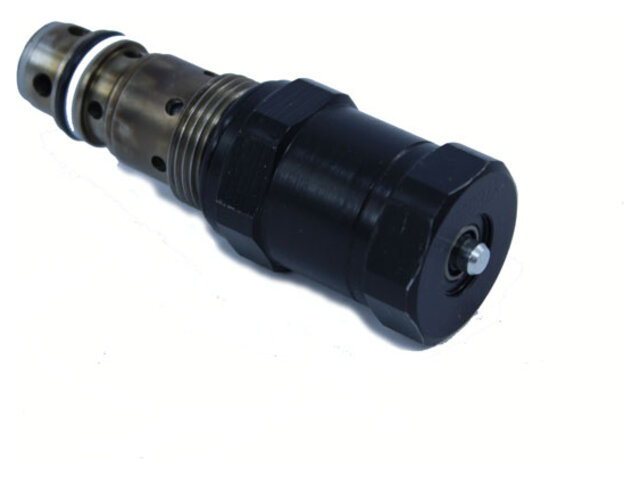 | 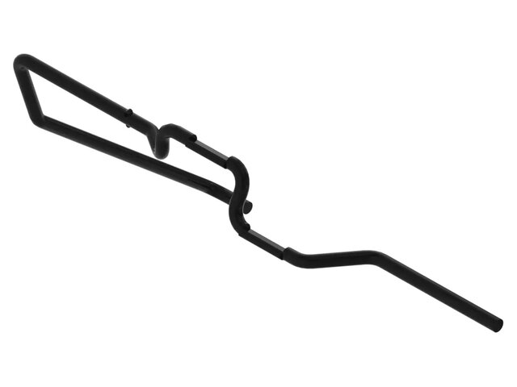 | 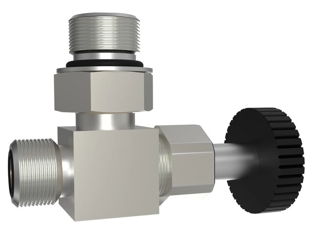 |
| MIA885144 | M146148 | AM134625 |

The relief valve photo is a dealer shot of this valve family. The 2WD
and 4WD versions look identical and differ only by the stamp, so go by
the stamp rather than the picture.

**1. Transaxle hydrostatic pressure relief valve, MIA885144. Strongly
recommended.**

This is the one upgrade genuinely worth doing if you run a loader.
Picture it: you are in 4WD, pushing into a pile, engine revved and the
forward pedal down. The wheels cannot spin because traction is good or
you have hit a stump. Pressure builds in the hydrostatic system with
nowhere to go. The relief valve opens at a safe pressure and dumps the
excess, so an expensive transaxle does not get hammered.

Little Bull's own rule: if you push the tractor hard, replace it. If
you are gentle and avoid dead stalls, it is optional. Running a front
loader counts as pushing it hard.

**MIA885144 is the current Deere number.** It supersedes AM122228, and
it is the one to order today. Deere lists it as fitting X728, X729,
X738, X748, X749, X758 and X948, which is the 4WD and all-wheel-steer
side of the range. Older references, including Little Buck's install
guide, still use the previous numbers:

| Drivetrain | Older number | Stamped | Current Deere part |
|---|---|---|---|
| 2WD machines | BM15043 (AM121248) | "2WD" | ask the dealer |
| **4WD, incl. X758** | BM15044 (AM122228), sold as BW15044 | **"4WD"** | **MIA885144** |

Whichever number is on the box, check for the **4WD stamp on the valve
itself**.

It installs in place of the forward free-wheeling valve. The job means
pulling the seat and fender deck to reach the fuel tank, then swapping
both the old free-wheeling valve and its control lever. One caution
that matters: **clean the transaxle before removing the valve**, or
you will drop dirt straight into the hydraulic system.

**2. Neutral control rod, M146148. Buy it with the valve.**

This is the free-wheeling valve control lever, and it is the reason
Little Buck's install guide is titled for the lever as well as the
valve. The new relief valve is physically bigger than the free-wheeling
valve it replaces, so the standard lever no longer clears it. The
M146148 rod is bent to fit around the larger valve. Order it at the
same time or the install stops halfway.

- [Little Buck Loader install guide](https://www.littlebuckloader.com/blog/2021/6/29/install-free-wheeling-control-lever-and-transaxle-hydrostatic-pressure-relief-valve)
- Video walkthrough, all X700 models with K9X axles:

[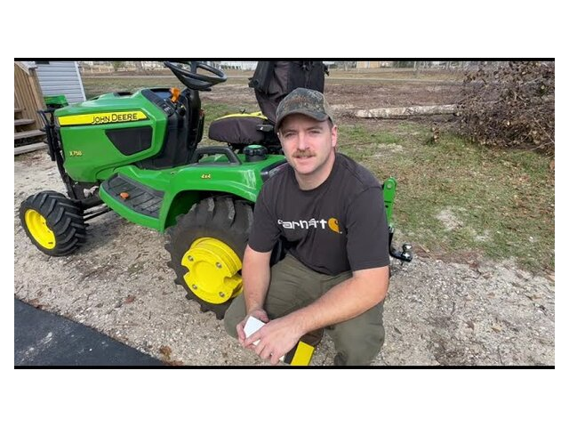](https://www.youtube.com/watch?v=5ubyJVu5mPw)

**3. Flow control valve, AM134625. Optional.**

Deere also lists this one as a hydraulic cylinder lockout valve, which
describes what it does better than "flow control" does. It goes in the
line feeding the rockshaft, the circuit that raises the mower deck and
the 3-point. It has a black knurled knob you turn by hand.

Close it and oil stops going to the rockshaft first and goes straight
to the front outlets instead, so the loader responds instantly rather
than waiting for the deck cylinder to reach the end of its travel.
Open it and the deck and 3-point work normally again.

> **Check this one on your own machine before you rely on it.** Deere's
> description is that closing the valve disables the deck hydraulics
> and speeds up the loader, which means **closed for loader work, open
> for mowing**. The note on your parts sheet says the opposite. It is
> also a diverter rather than a hard stop: owners report that with a
> deck or a rear implement mounted, things still creep up and down
> slowly, and that around 5 or a quarter turn past 5 on the dial is
> where the deck stops drifting. Turn the knob and watch what actually
> moves.

If you would rather not spend the $283, the free version of this fix is
to run the mower deck at its highest position whenever the loader is
on. That is the same advice Little Buck gives, and it costs nothing.

**4. Updated cutoff valve. Optional, and no part number yet.**

Separate from the above. Little Bull's wording: some customers have
reported improved implement performance by replacing the factory cutoff
valve, and while it is not required it may make loader operation more
efficient. They have not published a part number. Run the stock valve.
If it feels sluggish, call your Deere dealer with the serial number,
mention Little Bull's guidance, and have them cross-reference the
updated valve for the X758 hydraulic circuit.

---

## Attaching the Little Buck

Four steps, and the whole thing takes a couple of minutes once you
have done it twice.

1. **Close the loader.** Curl the bucket back and bring the arms down
   so the loader sits in its closed position. Any other position makes
   the alignment fight you.
2. **Set it on the tractor.** Lift by the **middle beam** and lower
   the loader onto the landing bar and the attachment points at the
   front of the tractor. The attachment points sit low at the front,
   parallel to the wheels, with the landing bar directly above them.
3. **Lock the pins.** Push in and twist the two spring-loaded pins,
   one on each side, until they seat and lock.
4. **Connect the hoses.** Match the color-coded loader hoses to the
   matching tractor outlets. See the color map below.

| Watch this one first | Older walkthrough |
|---|---|
| [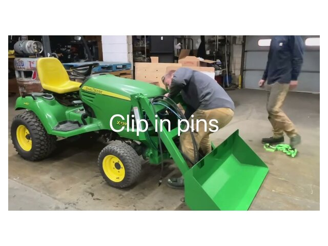](https://www.youtube.com/watch?v=XtKedyOh9pk) | [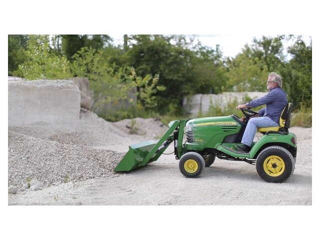](https://www.youtube.com/watch?v=ZFawwq8FRek) |

Both pictures are links: [Attaching and Detaching Your Little Buck
Loader](https://www.youtube.com/watch?v=XtKedyOh9pk) and the older
[How to attach your Little Buck
Loader](https://www.youtube.com/watch?v=ZFawwq8FRek).

Your tractor needs **four quick-connect hydraulic outlets**, that is
two dual ports, for full loader function. Machines with only two
outlets need a converter kit, and that costs you power steering
capability.

---

## Attaching the Little Bull

The Bull is heavier and mounts to the frame rather than to the weight
bracket, so there is more to it. Use the rolling jack that came with
the loader. Do not try to muscle 400 lbs into alignment.

This is the order Little Buck gives in their current video. Two things
in it surprise people: **the hoses go on early**, before the loader is
mounted, because you need the tractor's hydraulics to work the jack;
and the spring-loaded pins come out **after** the jack is off, not
before.

1. **Swap the motor mount brackets.** Pop the hood and remove the two
   motor mount brackets on each side. Fit the brackets that came with
   the loader in their place.
2. **Get the loader off the pallet.** Take off the ratchet strap,
   unscrew the three screws in the bucket, and tip the loader back
   toward the tractor.
3. **Plug in the color-coded hoses.** See the
   [hose color map](#hydraulic-hose-color-map).
4. **Lower onto the jack.** Start the tractor and lower the hydraulics
   until the jack touches the ground.
5. **Roll it on.** Raise the jack until the top plate clears the weight
   bar, roll the loader in right above the bar, and pop it on.
6. **Unscrew the jack and take it off**, for maximum clearance.
7. **Free the spring-loaded pins** from their notches, one on each
   side.
8. **Fit the turnbuckles.** Attach the motor mount bracket turnbuckle
   on each side and tighten until snug, then **another two turns**.
9. **Restart the tractor** and run the loader through its range to
   confirm everything works.

> The FAQ says to snug the turnbuckles and add **one** full hand turn,
> while the current video says **two**. Two is the newer instruction.
> Either way they loosen with vibration, so see
> [Troubleshooting](#troubleshooting) for the jam nut fix that stops
> them backing off for good.

Two short clips cover the early steps in more detail:

| Step 1: pop the hood | Step 2: attach the supports |
|---|---|
| [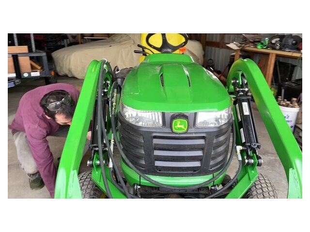](https://www.youtube.com/watch?v=rSjgo0KZZdc) | [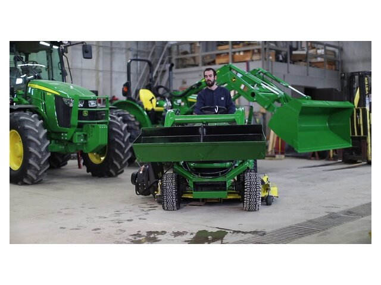](https://www.youtube.com/watch?v=KC_WQg4jeYQ) |

**Full walkthrough video:
[Attaching your Little Bull Loader to your John Deere - Updated!](https://www.youtube.com/watch?v=kixGRO86FYc)**

[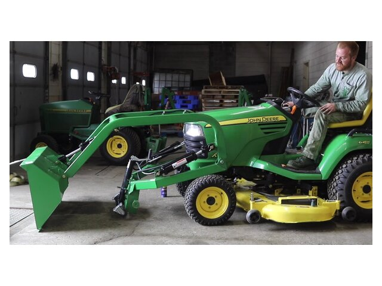](https://www.youtube.com/watch?v=kixGRO86FYc)

Running an Antler Grappler too? There is a combined video:
[Attaching Your Little Bull Loader and Antler Grappler](https://www.youtube.com/watch?v=pmSc1ZKGFqg).

**Note:** the Little Bull does not work with a cab, hard or soft. If
you run a cab, the Little Buck is the one that fits.

---

## Hydraulic hose color map

The loader hoses are color-coded and so are the tractor outlets. Match
color to color. The catch is that the **X series reverses the layout**
compared with the older tractors, so do not go by memory if you have
owned both.

**300 series, and 425 / 445 / 455:**

| | Left | Right |
|---|---|---|
| **Top** | yellow | silver |
| **Bottom** | black | green |

**X series:**

| | Left | Right |
|---|---|---|
| **Top** | black | green |
| **Bottom** | yellow | silver |

Getting it wrong is not a disaster. Per the manufacturer, hooking them
up backwards on the first try will not damage the tractor or the
loader. The lift or tilt simply will not work correctly, which tells
you to swap a pair. Full article:
[Hydraulic Hose Connections 101](https://www.littlebuckloader.com/blog/2026/6/4/hydraulic-hose-connections-101).

---

## Detaching

Order matters here, mostly because of trapped hydraulic pressure.

1. **Pick your spot.** Somewhere level, dry, and out of the way. The
   loader will live there until you come back for it.
2. **Set the loader down** so the arms are low and you can reach the
   spring-loaded pins. On the Little Bull, fit the jack first and let
   it take the weight. See [The Little Bull's jack](#the-little-bulls-jack).
3. **Shut the tractor off.**
4. **Bleed the pressure.** With the engine off, push both the tilt
   lever and the arm lever **up and down** several times. This is the
   step people skip, and it is why their hoses will not go back on
   later.
5. **Disconnect the hoses.**
6. **Pull the pins.** On the Bull, back off the turnbuckles and remove
   the support arms first.
7. **Back the tractor away**, slowly and straight.

Reverse the attach steps and you have it.

| Little Buck, both directions | Little Bull, detaching |
|---|---|
| [](https://www.youtube.com/watch?v=XtKedyOh9pk) | [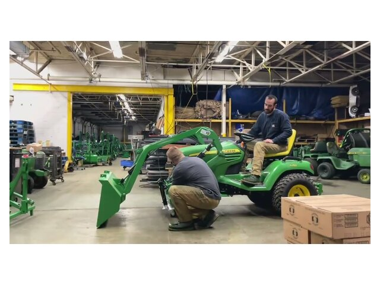](https://www.youtube.com/watch?v=47YNdqzS61o) |

---

## The Roll-Off Caster Kit

A pair of wheels for the loader itself. The kit clamps two steel bars
with casters onto the bucket, so once the loader is off the tractor it
stands on its own and rolls. No lifting, no shuffling 250 lbs of steel
across the floor, no fighting the alignment when you put it back on.
It also lets you park the loader in a corner of the garage instead of
leaving it out in the yard.

**$490**, and the box holds three things: two heavy-duty steel caster
support bars and one steel arm locking tie. Made in Sycamore.

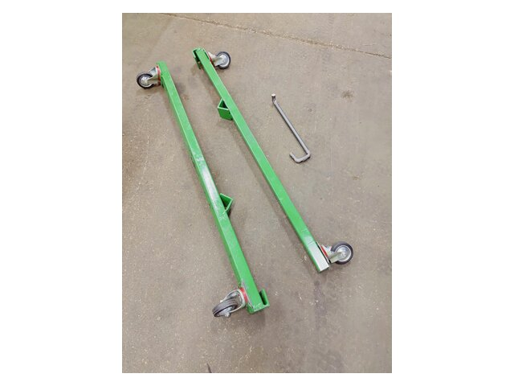

*Two caster bars and the locking tie. That is the whole kit.*

> **This is a Little Buck accessory.** The product page lists it as
> fitting the Little Buck only, on the 4X5 and X-Series tractors, and
> the Little Bull is not mentioned anywhere on that page. If you run a
> Bull you do not need it: the Bull comes with its own jack on rollers,
> covered in [the next section](#the-little-bulls-jack).

There is a second limitation worth knowing. The kit is for taking the
loader off and putting it back on **after** the normal first-time
installation. You cannot use it to unbox a new loader and mount it for
the very first time.

### How it works

1. **Attach the caster bars.** Raise the bucket to a comfortable
   working height. Clip one end of each steel bar onto the bottom lip
   of the bucket, between the welds.
2. **Lower to the ground.** Bring the bucket down until the casters are
   solidly on the floor and the weight has come off the tractor's front
   end.
3. **Release the mounting pins.** Pull the spring-loaded pins on both
   sides to free the loader from the tractor mount.
4. **Tilt and lift off.** Use the tilt cylinder to raise the loader
   frame clear of the mounts. Watch your hose slack here.
5. **Lock the arms.** Fit the steel tie so the bucket is locked to the
   loader arms and the whole thing stays rigid and upright.
6. **Depressurize and roll away.** Shut the tractor off, work the
   levers to release line pressure, disconnect the hoses, and push the
   loader wherever you want it.

Step 6 is the same pressure-bleeding step as in
[Detaching](#detaching), and skipping it causes the same trouble with
hoses that will not reconnect.

| Install the kit | Reattach in minutes |
|---|---|
| [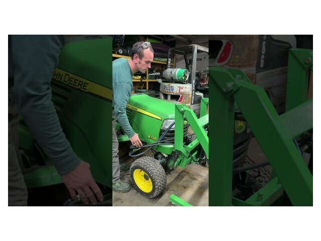](https://www.youtube.com/shorts/OhScUK2UUvk) | [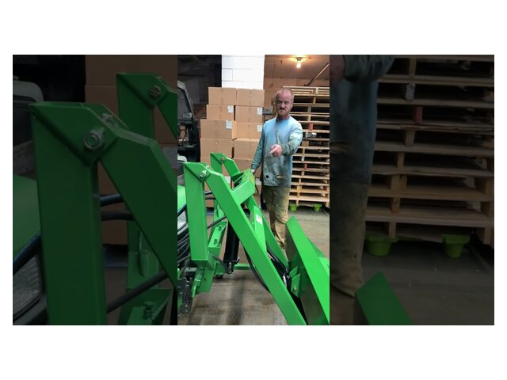](https://www.youtube.com/shorts/7BRYCFL8UMA) |

---

## The Little Bull's jack

**If you run a Little Bull, you do not need the caster kit.** The Bull
ships with its own detachable screw jack on rollers, and it does the
same job: it carries the loader's weight while you mount or dismount,
and it is what the loader stands and rolls on once it is off the
tractor. That is the whole reason the caster kit is a Buck-only
accessory. The Buck has no jack, so Little Buck sells it one. The Bull
already has the capability in the box.

The jack is a screw jack. You wind it up and down by hand to raise and
lower the front of the loader, and it rides on rollers so the loader
can be pushed around once its weight is on the jack rather than on the
tractor.

### Fitting the jack and taking the loader off

The jack goes on before anything gets unpinned, because it has to take
the weight first. Nothing here should require lifting.

1. **Fit the jack** to the loader and wind it down until it is close to
   the floor.
2. **Lower the loader onto it.** With the tractor running, lower the
   hydraulics until the jack is solidly on the ground and the loader's
   weight has come off the tractor's front end.
3. **Back the turnbuckles off** and free them from the motor mount
   brackets on both sides.
4. **Put the spring-loaded pins back** into their notches so the
   mount releases.
5. **Wind the jack** to lift the top plate clear of the weight bar.
6. **Shut the tractor off and bleed the pressure.** Work the tilt and
   arm levers up and down with the engine off, then disconnect the
   hoses. Skip this and the couplers will not go back together later.
   Same trap as in [Detaching](#detaching).
7. **Back the tractor away** slowly and straight. The loader stays
   standing on its jack.

Putting it back on is the same sequence in reverse, and it is written
out step by step under
[Attaching the Little Bull](#attaching-the-little-bull). Steps 4
through 6 there are the jack steps.

### Moving it around the garage

Once the loader is standing on its own jack with the hoses off, it
rolls. Push it by the frame or the arms rather than the bucket, so you
are pushing through the structure instead of levering on the bucket
pins.

A few things that make this easier:

- **Wind the jack down for rolling, up for parking.** More clearance
  clears cracks and thresholds. Wound down, the loader sits stable and
  will not creep on a sloped floor.
- **Rollers want a hard, flat floor.** Sealed concrete is ideal. Gravel
  and expansion joints will stop small rollers dead, so lay a scrap of
  plywood over a bad seam rather than forcing it.
- **Watch the balance.** Weight sits high and forward on these loaders.
  Move slowly, keep the bucket curled down and low, and turn in wide
  arcs rather than pivoting sharply.
- **Park it where you can drive back to it.** You need a straight
  approach with the tractor to reattach, so leave clearance in front,
  not just to the sides.
- **Chock it on any slope.** A wheeled 400 lb loader that starts moving
  on its own is not something you want to catch by hand.

> Little Buck has not published a standalone photo of the jack or a
> video devoted to it. It is shown in use in both loader videos below.
> In the attach video it appears around the steps where the loader is
> lowered onto it and then unscrewed; in the detach video it is what
> the loader is left standing on.

| Attaching, jack in use | Detaching, jack takes the weight |
|---|---|
| [](https://www.youtube.com/watch?v=kixGRO86FYc) | [](https://www.youtube.com/watch?v=47YNdqzS61o) |

---

## Moving around with it

**It is a material mover, not an excavator.** Dirt, mulch, gravel,
snow, all fine. Prying stumps and digging into hard ground is not what
these are built for. You can fit a toothbar (the Piranha is the one
they recommend) as long as you are not excavating with it.

Roughly 10 feet of tractor plus loader on the Little Buck, so give
yourself room in gates and doorways.

Some practical habits:

- Carry the bucket low while travelling. High and loaded is how
  garden tractors tip.
- Keep the ballast on whenever the loader is on. Every time.
- Take slopes straight up and down rather than across the face.
- Do not lift people, and do not let anyone stand under a raised
  bucket.
- Ease into the hydraulics rather than slamming the levers.

**Mowing deck.** On the 400, 420 and 430 the deck has to come off. On
everything else the deck can stay. With the deck on you may need to
pause and let the lift cylinder hit the end of its stroke before the
tilt responds, and setting the deck to its highest position minimizes
that. Optional lockout valves send flow to tilt only when you are not
mowing.

**Opening the hood with the loader attached.** With the arms fully
down the hood will not clear. Start the tractor, raise the arms to
**half height**, drape a shop rag over the crossbar so you do not
scratch the paint, and open the hood. Thirty seconds, and you can
reach the dipstick and radiator normally.
([blog post](https://www.littlebuckloader.com/blog/2026/5/20/how-to-open-the-hood-on-a-john-deere-tractor-with-a-little-buck-or-bull-loader-attached))

While attaching, a strip of pipe insulation or a folded towel on the
hood edge saves the green paint. There is a
[whole post on cheap hood protection](https://www.littlebuckloader.com/blog/2025/11/19/a-simple-inexpensive-way-to-protect-your-john-deere-garden-tractor-hood-when-attaching-a-loader).

---

## Swapping attachments (QuikSystem)

If you have the QuikMount, the front plate is a quick-attach and the
tools come off and on without any tools and without removing the
loader. The full QuikSystem bundle is QuikMount, QuikBucket (48"
utility bucket), QuikForks, QuikGrapple and QuikPush (50" snow
pusher). No extra hydraulic circuits needed. Ballast is still
mandatory.

| QuikMount on the tractor | QuikBucket, 48" |
|---|---|
| 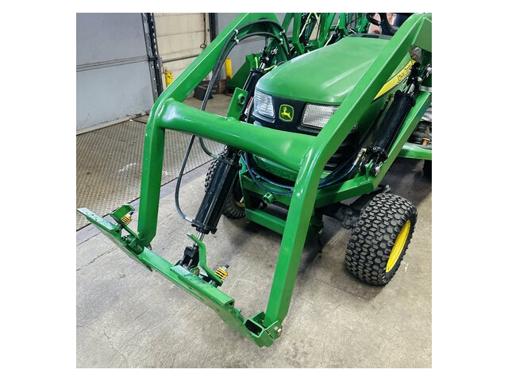 | 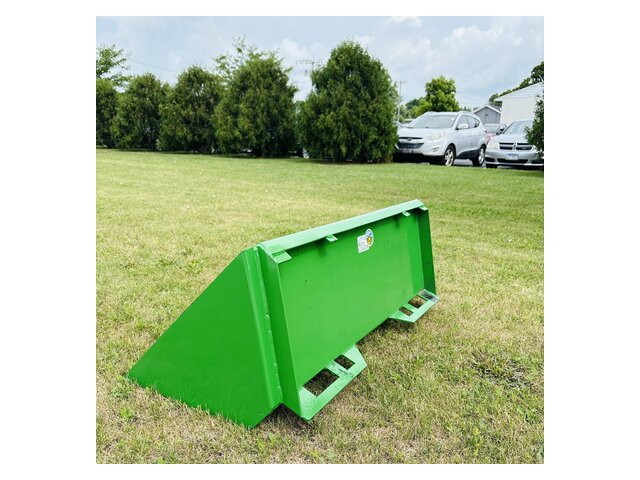 |
| **QuikForks** | **QuikGrapple** |
| 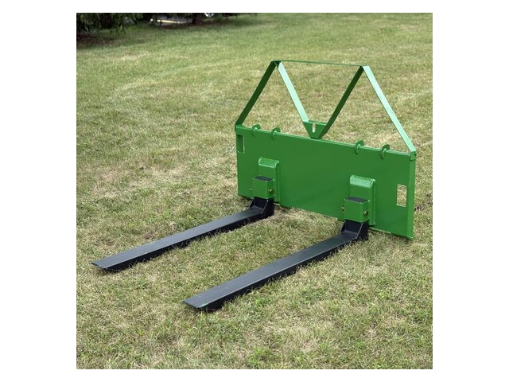 | 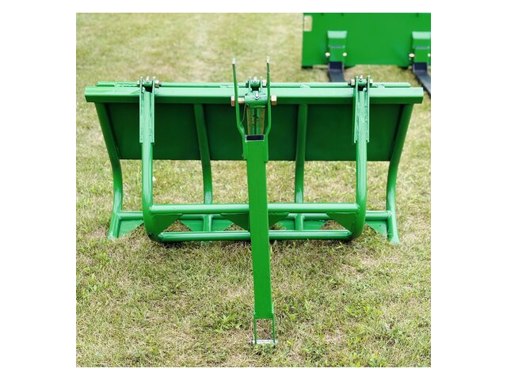 |
| **QuikPush snow pusher, 50"** | **Quick-attach plate, head on** |
| 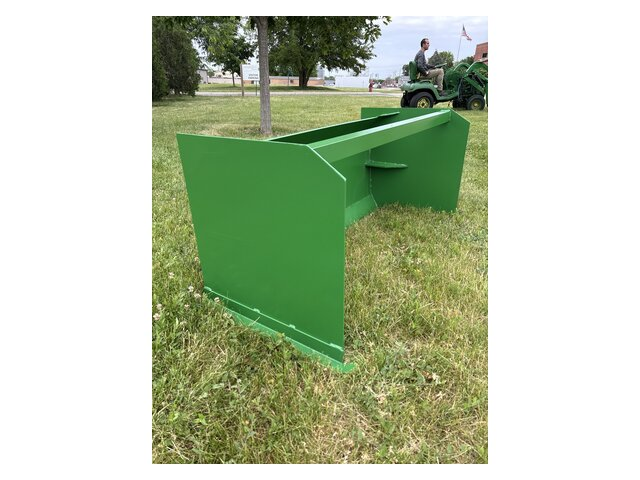 | 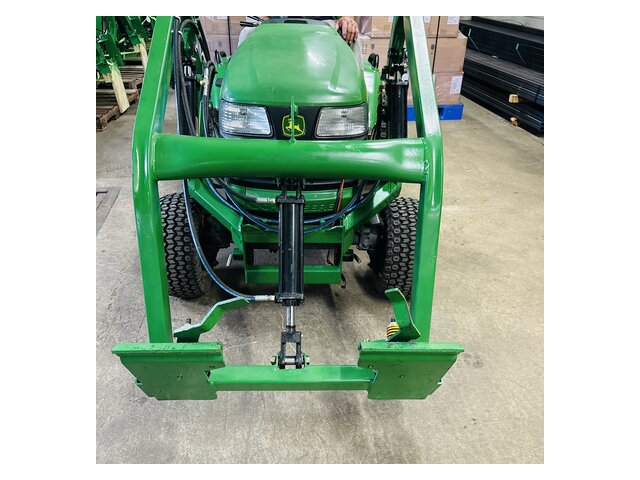 |

**The Antler Grappler** is the mechanical grapple, and it is a neat
piece of design: it needs no extra hydraulic line at all. It runs off
the bucket tilt linkage. Tilt forward and the grapple opens, tilt back
and it closes. It fits every Little Buck and Little Bull. The bolt-on
plates sit 24" apart center to center, and the spacing is adjustable.

[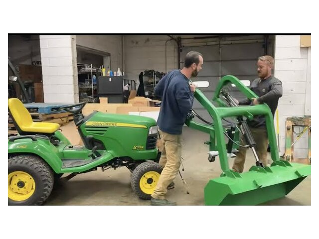](https://www.youtube.com/watch?v=pmSc1ZKGFqg)

---

## Moving the loader to a different tractor

Most swaps need a **new mounting base and new hoses** cut to length
for the new machine. The exceptions and dead ends:

| From | To | What it takes |
|---|---|---|
| 425 / 445 / 455 | X series | No kit. Grind about 1/4" off the front weight bar and rotate the cylinders 180 degrees |
| X series | 425 / 445 / 455 | Not possible |
| 318-style | X series, 4x5, or 400 / 420 / 430 | New mounting base and hoses |
| 400 / 420 / 430 | X700 series | New mounting base and hoses |

Conversion kits are sold on the site. Call them before you buy, since
the fit depends on the exact year.

---

## Troubleshooting

**The hoses will not reconnect after removal.**
Almost always trapped pressure in the tilt circuit. Wrap a rag around
the male nipple on the tilt hose and press the center pin. Fluid will
squirt out, which is why the rag is there. That releases the pressure
and the coupler will seat. Bleeding the levers before disconnecting
(step 4 of detaching) prevents this in the first place.

**Lift or tilt works backwards, or one function does nothing.**
Hoses are on the wrong ports. Check the color map above, remembering
that the X series layout is flipped.

**Turnbuckles keep backing off (Little Bull).**
Normal, caused by vibration on rough ground and by uneven loads.
Quick fix: tighten the offending one 1 to 2 extra full turns.
Permanent fix: thread a **1/2" coarse-thread nut** onto the
right-hand threaded rod and snug it against the body as a jam nut.
Costs pennies and ends the problem.
([blog post](https://www.littlebuckloader.com/blog/2025/12/18/how-to-keep-your-turnbuckles-tight-on-the-little-bull-loader-troubleshooting-amp-easy-fixes))

**Sluggish or weak hydraulics on an X700.**
Raise the mower deck to its highest position first, since a low deck
steals oil from the loader. If that does not settle it, see
[The three valves](#the-three-valves-and-the-one-upgrade-worth-doing):
a flow control valve or an updated cutoff valve can help, and if you
work the tractor hard the transaxle pressure relief valve is the
upgrade to make.

**Loader feels sloppy at the mount.**
It should not wear there. The Buck uses spring-loaded pins in the
weight bracket channel, the Bull uses mid-mount brackets that prevent
play. If there is slop, check the pins and the turnbuckles before
assuming wear.

---

## Maintenance at a glance

| Interval | Job |
|---|---|
| Before first use | Two pumps of grease per zerk |
| Every 10 to 15 hours | Re-grease all fittings |
| Every use | Walk around, check pins seated, check hose routing |
| Occasionally | Check turnbuckle tension (Bull), check tire PSI at +10 over sidewall |
| Seasonally | Check hydraulic fluid level, inspect hoses for chafing |

Grease: Valvoline Multi-Purpose (VV614).
Hydraulic fluid: JDM J20C spec, Type F ATF compatible.

---

## Video library

All from the [Little Buck Loader channel](https://www.youtube.com/@LittleBuckLoader)
unless noted.

| Video | Topic |
|---|---|
| [Attaching and Detaching Your Little Buck Loader](https://www.youtube.com/watch?v=XtKedyOh9pk) | The main Little Buck video, both directions |
| [How to attach your Little Buck Loader](https://www.youtube.com/watch?v=ZFawwq8FRek) | Earlier attach walkthrough |
| [Attaching your Little Bull Loader to your John Deere - Updated!](https://www.youtube.com/watch?v=kixGRO86FYc) | Current Little Bull procedure |
| [Step 1: Pop the hood and get started](https://www.youtube.com/watch?v=rSjgo0KZZdc) | Little Bull, step 1 |
| [Step 2: Attaching the supports](https://www.youtube.com/watch?v=KC_WQg4jeYQ) | Little Bull, step 2 |
| [Detaching Your Little Bull Loader](https://www.youtube.com/watch?v=47YNdqzS61o) | Taking the Bull back off |
| [Roll-Off Caster Kit Install](https://www.youtube.com/shorts/OhScUK2UUvk) | Fitting the caster kit, short |
| [Reattach in Minutes with the Roll-Off Caster Kit](https://www.youtube.com/shorts/7BRYCFL8UMA) | Putting the loader back on, short |
| [Attaching Your Little Bull Loader and Antler Grappler](https://www.youtube.com/watch?v=pmSc1ZKGFqg) | Loader plus grapple |
| [Z BUCK Loader for a John Deere Zero Turn](https://www.youtube.com/watch?v=pD0BeGkJiVM) | Z Buck |
| [X700 Transaxle Hydraulic Pressure Relief Valve Install](https://www.youtube.com/watch?v=5ubyJVu5mPw) | The valve upgrade, all K9X axles, by Josh's Green Garage |
| [Little Bull Review and Un-Palletizing](https://www.youtube.com/watch?v=abiWGdt0bzM) | Unboxing, by Josh's Green Garage |

The channel also has videos on the JD Talon, KBX Talon, snow pusher
and bucket extender installs, and the QuikSystem conversion kit.

---

## Reference links

- [Setup / installation page](https://www.littlebuckloader.com/setup-your-little-buck-loader)
- [FAQ](https://www.littlebuckloader.com/frequently-asked-questions-faq) - the deepest single source on the site
- [Little Buck operator's manual (PDF)](https://drive.google.com/file/d/1juCGjJ1KSfgrv6OV5994FIeXOiZZhPk8/view)
- [Install the free-wheeling lever and transaxle pressure relief valve](https://www.littlebuckloader.com/blog/2021/6/29/install-free-wheeling-control-lever-and-transaxle-hydrostatic-pressure-relief-valve) - part numbers and procedure
- Deere parts: [MIA885144 pressure relief valve](https://shop.deere.com/us/product/MIA885144:-Pressure-Relief-Valve/p/MIA885144), [M146148 neutral rod](https://shop.deere.com/us/product/M146148:-Neutral-Rod/p/M146148), [AM134625 flow control valve](https://shop.deere.com/us/product/AM134625:-Flow-Control-Valve/p/AM134625)
- [What to know before you buy, X700 series](https://www.littlebuckloader.com/blog/2025/7/1/what-to-know-before-you-buy-little-buck-or-little-bull-loaders-for-john-deere-x700-series)
- [Little Buck product page](https://www.littlebuckloader.com/shop/p/little-buck-loader-front-end-loader-john-deere)
- [Little Bull product page](https://www.littlebuckloader.com/shop/p/little-bull-loader-front-end-loader-john-deere)
- [Little Bull QuikSystem](https://www.littlebuckloader.com/shop/p/little-bull-quiksystem)
- [Roll-Off Caster Kit](https://www.littlebuckloader.com/shop/p/little-buck-loader-roll-off-caster-kit) - $490
- [Conversion kits](https://www.littlebuckloader.com/shop/p/loader-conversion-kit)
- [Buck vs Bull vs QuikMount comparison](https://www.littlebuckloader.com/blog/2025/10/27/comparing-john-deere-garden-tractor-loaders-little-buck-vs-little-bull-vs-quikmount)
- [Will a Little Buck fit my John Deere?](https://www.littlebuckloader.com/blog/2025/10/17/will-a-little-buck-loader-fit-my-john-deere)
- [Why ballast weight matters](https://www.littlebuckloader.com/blog/2026/1/21/why-ballast-weight-matters-on-a-garden-tractor-especially-with-a-loader)
- [Greasing guide](https://www.littlebuckloader.com/blog/2026/5/20/why-doesnt-my-new-loader-come-pre-greased-and-how-to-grease-it-right)

There is also an active owners group on Facebook with hundreds of
customer videos and photos, which is worth joining for the odd
tractor-specific question.

---

## About the images

Every picture in this file is a local copy in `images/`, so the guide
reads offline. They come from Little Buck Loader's own product pages
and video thumbnails, and they belong to Little Buck Loader, LLC.

To refetch and rebuild them:

```sh
python3 s1_download_images.py     # add --force to refetch
python3 s2_clean_images.py
```

All of them are standardized to 640x480 JPEG at 72 DPI with a white
margin, which is why they line up evenly on the page. Markdown cannot
resize an image, so that canvas is the size you actually see. Change
it in the constants at the top of `s2_clean_images.py`.

---

*Compiled September 2026 from Little Buck Loader's published
instructions, FAQ, blog and videos. Prices and specs were current at
that date. Nothing here replaces the operator's manual or a phone call
to the factory.*
