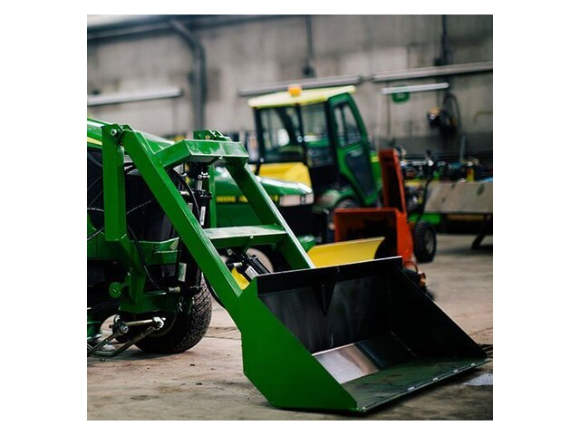
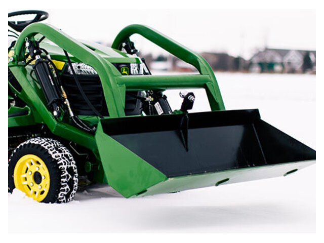
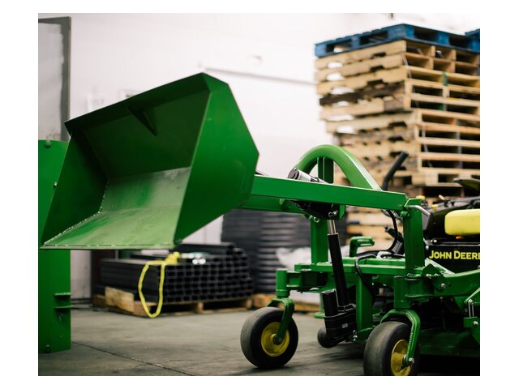
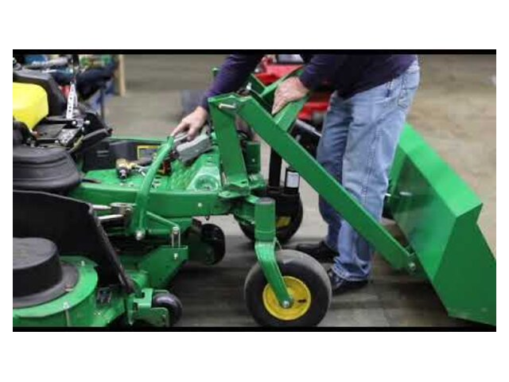

--------------------------------------------

I have bought Little Bull Loader
There is also Little Buck Loader

https://www.youtube.com/@LittleBuckLoader
https://www.littlebuckloader.com

Please make an md file in current directory 
with instructions on how to handle them.
How to attach, detach, move around.

Please include images and videos.

--------------------------------------------

Please download images needed for the LOADER_GUIDE
into directory "images"

We need to process the images to bring them
to a standard format:
   convert to jpg
   resize
   add margins

Please modify the script s2_clean_images.py to do that
with all images under "images" directory

Please update LOADER_GUIDE.md to use those local images

--------------------------------------------

Add to LOADER_GUIDE.md
relevant content from files in this local directory:

~/docs/FAMILY/accounting/Mortgage/__833_County_Rd_94/d9_after_sale/LittleBullFrontLoader/

--------------------------------------------

The links to images do not work correctly. They do not show images in the md viewer.

for example, on line 46

 

or on line 55

 

etc.

--------------------------------------------

Please include this info into the GUIDE:

~/docs/FAMILY/accounting/Mortgage/__833_County_Rd_94/d9_after_sale/LittleBullFrontLoader/FL_valves.md

Also make a table of contents at he beginning

--------------------------------------------

please create script to create LOADER_GUIDE.pdf from md file

--------------------------------------------

Please add info, iamge and videos about roll-off caster kit

https://www.youtube.com/shorts/7BRYCFL8UMA

https://www.youtube.com/shorts/OhScUK2UUvk

--------------------------------------------

For little buck loader we have roll-off caster kit.

For little bull loader we don't need it.
It has its own caster.
Please provide instructions how to attach and detach it and how to use it to move the loader around the garage. Provide image(s) and video

--------------------------------------------

In this folder we have created a LOADER_GUIDE file in md and pdf format. It covers two products - 
 - Little Bull Loader
 - Little Buck Loader

https://www.youtube.com/@LittleBuckLoader
https://www.littlebuckloader.com

What other products does this vendor provide?
Please create a file LITTLE_BUCK_PRODUCTS.md and pdf
with all products they provide (not only front-loaders).

--------------------------------------------

I spoke with the owners of Little Buck company.
Offered the PDFs to them to put on their website.

Can you please rewrite both guides to be from the first face.
This means, change "they are" to "we are", etc
everywehre throught both guides.

--------------------------------------------

--------------------------------------------
